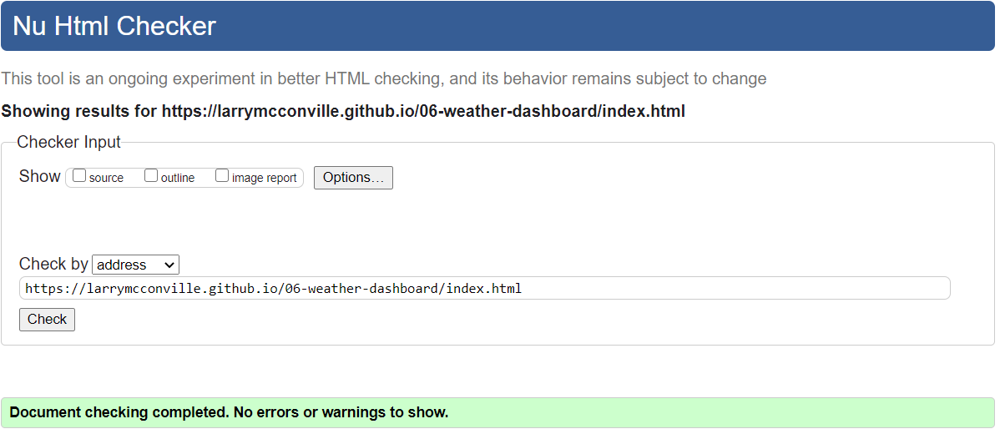

# [**06-WEATHER-DASHBOARD**](https://larrymcconville.github.io/06-weather-dashboard/) :link:

## Project Goal

Developers are often tasked with retrieving data from another application's API and using it in the context of their own. Third-party APIs allow developers to access their data and functionality by making requests with specific parameters to a URL. Your challenge is to build a weather dashboard that will run in the browser and feature dynamically updated HTML and CSS.

Use the [OpenWeather API](https://openweathermap.org/api) to retrieve weather data for cities. The documentation includes a section called "How to start" that will provide basic setup and usage instructions. Use `localStorage` to store any persistent data.

## User Story

```
AS A traveler
I WANT to see the weather outlook for multiple cities
SO THAT I can plan a trip accordingly
```

## Acceptance Criteria

```
GIVEN a weather dashboard with form inputs
WHEN I search for a city
THEN I am presented with current and future conditions for that city and that city is added to the search history
WHEN I view current weather conditions for that city
THEN I am presented with the city name, the date, an icon representation of weather conditions, the temperature, the humidity, the wind speed, and the UV index
WHEN I view the UV index
THEN I am presented with a color that indicates whether the conditions are favorable, moderate, or severe
WHEN I view future weather conditions for that city
THEN I am presented with a 5-day forecast that displays the date, an icon representation of weather conditions, the temperature, and the humidity
WHEN I click on a city in the search history
THEN I am again presented with current and future conditions for that city
WHEN I open the weather dashboard
THEN I am presented with the last searched city forecast
```

## Solution

All of the application development has been performed in JavaScript utilizing jQuery to work with the DOM. The design intent was to leverage the DRY principle whereby the `creation` of almost all of the DOM elements, as well as the `setting`, `getting` and `saving`, all occurs in the JavaScript code. The `index.html` uses a Bootstrap container with two columns which sets up the page layout. The search history is a `col-3` and the main body of the page is defined as `col-9`.

The search history is built dynamically with each city in localstorage being rendered as a `<button>`. The main body of the page includes a single `card` on the top representing a summary of the searched city, and a `card-deck` on the bottom presenting the 5-Day forecast.

### init()

- Executed automatically when page loads.
- Calls `getCitiesFromStorage()`
- If cities are found in storage, calls:
  - `searchCityWeather()`
  - `searchCityForecast()`

### getCitiesFromStorage()

- If cities exist in localstorage they are loaded into `cityHistory[]`
- `loadLastCity` flag is set to `true`
- Calls `renderCityHistory()`

### renderCityHistory()

- Empties the `#search-list` parent so the updated list of children may be appended
- Creates a `<button>` for each city in history
- Prepends the new buttons to `#search-list`

### searchCityWeather()

- Builds URL inclusive of searched city
- Performs ajax call to the openweathermap _weather_ endpoint
- Response items captured from the promise include:
  - Name, Date, Icon, Temp, Humidity, Wind Speed, Latitude and Longitude
  - Calls `renderCityWeather(cityName, cityDate, cityTemp, cityHumidity, cityWindSpeed, cityIconURL)`
  - Calls `UVIndex(lat, lon)`

### UVIndex()

- Receives `lat` and `lon` from `searchCityWeather`
- Builds url inclusive of lat and lon
- Performs ajax call to the openweathermap _uvi_ endpoint
- Receives response.value
- Calls `UVIndexScale(response.value)`

### UVIndexScale()

- Receives the UV Index value from `UVIndex` and assigns to local variable `indexValue`
- Evaluates the value of `indexValue` and assigns a class of _green_, _yellow_, _orange_, _red_ or _purple_ accordingly
- Defines a `<span>` having an attribute of the newly defined class.
- Defines an `<h5>` with _UV Index:_ text value, appends `<span>`
- Appends `<h5>`

### renderCityWeather()

- Receives cityName, cityDate, cityTemp, cityHumidity, cityWindSpeed, cityIconURL from `searchCityWeather()`
- Utilizes jQuery to build a card rendering the top of the page body with the searched city's information.

### searchCityForecast()

The forecast data represents data points for every 3 hours for the 5 days. The api will return 40 rows per city search. This function loops through the response evaluating the 12 character of `.dt_txt` === 2. When this condition evaluates `true` the matched record is pulled from the response. This represents 12:00 and provides a single data sampling for each respective day.

- Builds URL inclusive of searched city
- Performs ajax call to the openweathermap _forecast_ endpoint
- Response items captured from the promise include:
  - Hour, Date, Temp, Humidity, Icon
- Calls `renderCityForecast(forecastDate, forecastTemp, forecastHumidity, forecastIconURL)`

### renderCityForecast()

- Receives forecastDate, forecastTemp, forecastHumidity, forecastIconURL from `searchCityForecast()`
- Utilizes jQuery to build a card-deck rendering the bottom of the page body with the searched city's 5-day forecast.

### saveCityToStorage ()

- If the searched city is already in the history do nothing.
- If this is a new city add it to the history.
- Calls `renderCityHistory()`

### search-button

- This event listener pulls the value from the input form, if null, it simply returns.
- Calls saveCityToStorage()
- Calls searchCityWeather()
- Calls searchCityForecast()

### history-button

- This event listener pulls the value from the clicked button in the city history.
- Calls searchCityWeather()
- Calls searchCityForecast()

## HTML

The HTML includes a `container` with a `col-3` and a `col-9` representing the overall page layout:

- The `col-3` includes a single `<form>` with an `<input>` field and a search `<button>`, and serves to organize the search history.
- The `col-9` includes parent attachment points for the city summary `card`, and the city 5-Day forecast `card-deck`.

## CSS

- Buttons are defined with a common class to apply like styling.
- The navbar is being set to center justify the text
- The background color styling for the UV Index is being applied

## Application Screens


## Mock-Up

Provided application mock-up


## Validation

The application html was scanned with the [Markup Validation Service](https://validator.w3.org/).


## Sources Referenced

[w3schools](https://www.w3schools.com/html/) `|`[EPA Gov](//https://www.epa.gov/sunsafety/uv-index-scale-0)
